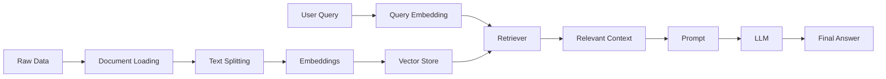
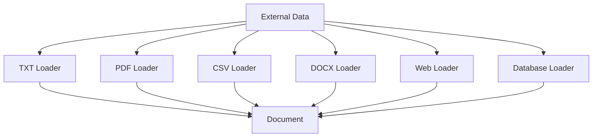
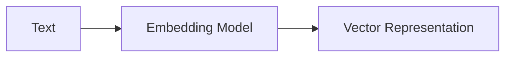
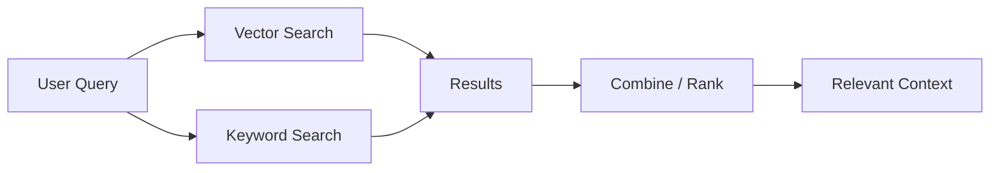
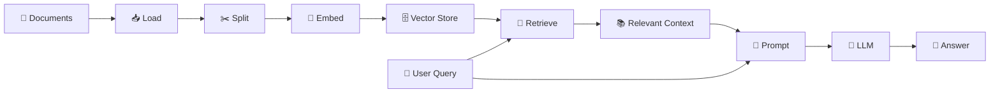
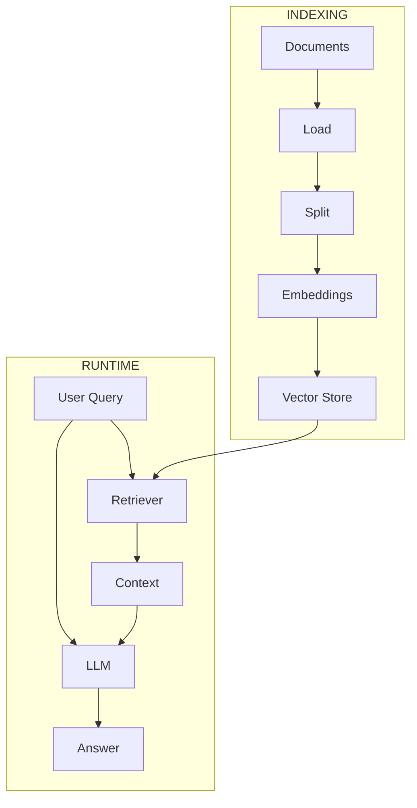
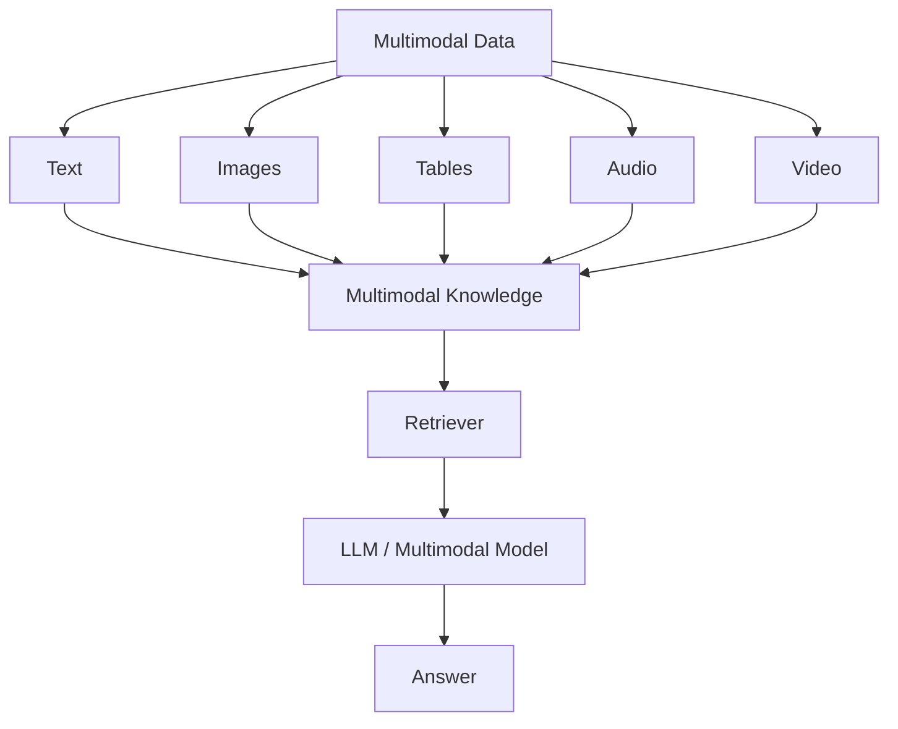
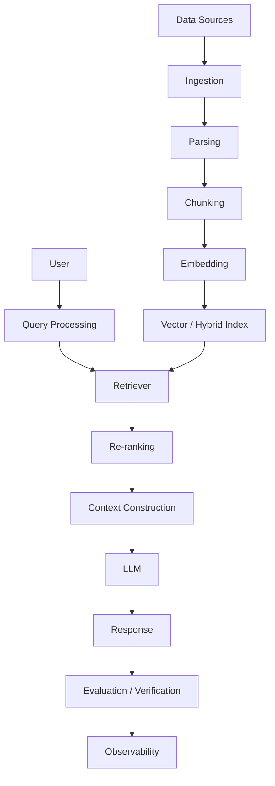

# 🧠 RAG — Retrieval-Augmented Generation

<p align="center">

# 🚀 RAG Learning

### From Documents → Knowledge → Retrieval → Context → Generation


</p>

---
# 🧠 RAG Learning

### Retrieval-Augmented Generation

Documents → Knowledge → Retrieval → Context → Generation

---

## 📦 Installation

Follow the steps below to set up the project locally.

### 1. Clone the Repository

```bash
git clone https://github.com/SubhasishElixor-HQ/Learn-RAG.git
cd Learn-RAG
```

### 2. Create a Virtual Environment

#### Using Python

```bash
python -m venv .venv
```

#### Activate on Windows PowerShell

```powershell
.venv\Scripts\Activate.ps1
```

#### Activate on Windows CMD

```cmd
.venv\Scripts\activate
```

#### Activate on macOS / Linux

```bash
source .venv/bin/activate
```

### 3. Install Dependencies

```bash
pip install -r requirements.txt
```

### ⚡ Using `uv`

If you use [`uv`](https://docs.astral.sh/uv/), you can create the environment and install dependencies faster:

```bash
uv venv
uv pip install -r requirements.txt
```

### 4. Verify Installation

Check that Python is available:

```bash
python --version
```

Check installed packages:

```bash
pip list
```

Or with `uv`:

```bash
uv pip list
```

### 5. Environment Variables

If your RAG application requires API keys, create a `.env` file in the project root:

```env
MODEL_API_KEY=your_api_key_here
```

**Never commit API keys to GitHub.**

Add the following to `.gitignore`:

```gitignore
.env
.venv/
__pycache__/
*.pyc
```

### 6. Run the Project

Run the main application:

```bash
python main.py
```

For individual learning modules:

```bash
python <filename>.py
```

---

## 🚀 Quick Setup

For a quick setup using `uv`:

```bash
git clone https://github.com/SubhasishElixor-HQ/Learn-RAG.git
cd Learn-RAG

uv venv
uv pip install -r requirements.txt

python Filename.py
```

---
# 📚 What is RAG?

**RAG (Retrieval-Augmented Generation)** is an architecture that allows an LLM to retrieve relevant information from an external knowledge source and use that information as context when generating an answer.

Instead of asking an LLM to answer only from its learned parameters:

```text
User Question
      ↓
     LLM
      ↓
   Answer
```

RAG introduces an external knowledge layer:

```text
                 ┌──────────────────┐
                 │   Knowledge Base  │
                 │ Documents / Data  │
                 └────────┬─────────┘
                          │
                          ▼
                    Retrieve Data
                          │
                          ▼
User Question ─────► Relevant Context
                          │
                          ▼
                         LLM
                          │
                          ▼
                     Final Answer
```

RAG is especially useful when an application needs to answer questions using **private, domain-specific, frequently changing, or external information**.

---

# 🎯 Why RAG?

LLMs have limitations:

* ❌ They may not know private company data
* ❌ Their knowledge can become outdated
* ❌ They can hallucinate
* ❌ They cannot automatically access every document
* ❌ Large documents cannot simply be placed into every prompt

RAG addresses these problems by retrieving relevant information before generation.

```text
             Traditional LLM
                  │
                  ▼
            Model Knowledge
                  │
                  ▼
               Answer


                 RAG
                  │
        ┌─────────┴─────────┐
        ▼                   ▼
 Model Knowledge      External Knowledge
        │                   │
        └─────────┬─────────┘
                  ▼
                LLM
                  │
                  ▼
              Answer
```

---

# 🏗️ RAG Architecture

A complete RAG system has two major phases:

## 1. Indexing

Prepare knowledge so that it can be searched efficiently.

## 2. Retrieval + Generation

Retrieve relevant knowledge at query time and give it to the LLM.



---

# 🔄 The Core RAG Pipeline

The fundamental RAG pipeline is:

```text
LOAD
  ↓
SPLIT
  ↓
EMBED
  ↓
STORE
  ↓
RETRIEVE
  ↓
CONTEXT
  ↓
GENERATE
  ↓
ANSWER
```

Current LangChain documentation describes the indexing side around documents, text splitters, embeddings, vector stores, and retrievers, followed by retrieval and generation.

---

# 01 — 📄 Documents

A **Document** represents information that can be processed and retrieved.

Examples:

```text
TXT
PDF
DOCX
CSV
JSON
HTML
Web Pages
Database Records
Notion
Google Drive
Slack
GitHub
```

Conceptually:

```text
Source
  │
  ▼
Document
  │
  ├── page_content
  │
  └── metadata
```

A document normally contains:

```text
Document
├── Content
│   └── Actual text
│
└── Metadata
    ├── source
    ├── page
    ├── title
    └── other information
```

Metadata becomes important later for filtering, citations, security, and source tracking.

---

# 02 — 📥 Document Loaders

Document loaders convert external data into a common document representation.



The goal is:

```text
Different Data Sources
        ↓
Standard Document Representation
        ↓
RAG Pipeline
```

LangChain's current documentation describes document loaders as providing a standard interface for bringing different sources into its `Document` representation.

---

# 03 — ✂️ Text Splitting

Large documents are usually divided into smaller pieces called **chunks**.

Why?

Because retrieving an entire large document is inefficient.

```text
Large Document
──────────────────────────────────────
│                                    │
│        Thousands of characters     │
│                                    │
──────────────────────────────────────
                  ↓
              Splitter
                  ↓
 ┌────────┐ ┌────────┐ ┌────────┐
 │Chunk 1 │ │Chunk 2 │ │Chunk 3 │
 └────────┘ └────────┘ └────────┘
```

### Important parameters

```text
chunk_size
chunk_overlap
separators
```

Example:

```text
Original Text

        ↓

Chunk 1
[AAAAAAAAAAAAAAAA]

Chunk 2
        [AAAAAAAAAAAAAAAA]

Chunk 3
                [AAAAAAAAAAAAAAAA]
```

The overlap helps preserve context between neighboring chunks.

`RecursiveCharacterTextSplitter` is one commonly recommended splitter for generic text in the current LangChain documentation.

---

# 04 — 🧩 Chunking Strategies

Chunking is more important than it initially appears.

Different data requires different strategies.

### Basic Chunking

```text
Document
   ↓
Fixed-size chunks
```

### Recursive Chunking

```text
Paragraph
   ↓
Sentence
   ↓
Word
   ↓
Character
```

### Semantic Chunking

```text
Document
   ↓
Meaning-based boundaries
   ↓
Semantic chunks
```

### Structure-aware Chunking

```text
PDF / Markdown / HTML
        ↓
Headers
Sections
Tables
Paragraphs
        ↓
Meaningful chunks
```

Good chunking improves retrieval quality.

---

# 05 — 🧠 Embeddings

An **embedding** converts text into a numerical vector that represents its semantic meaning.

```text
"Machine learning is a field of AI"
                 ↓
           Embedding Model
                 ↓
       [0.21, -0.43, 0.87, ...]
```

Conceptually:



Similar meanings should produce vectors that are close in vector space.

```text
                 AI
                ●
              ●
           ●
        ML

                         Pizza
                           ●
                         ●
```

Embeddings are used for semantic search and vector retrieval.

---

# 06 — 📐 Vector Similarity

Once text becomes vectors, we need a way to determine which vectors are similar.

Common similarity methods include:

* Cosine Similarity
* Dot Product
* Euclidean Distance

Conceptually:

```text
Query Vector
     │
     ├──────────────► Chunk A   ⭐⭐⭐⭐⭐
     │
     ├──────────────► Chunk B   ⭐⭐⭐⭐
     │
     └──────────────► Chunk C   ⭐
```

The most relevant chunks are retrieved based on similarity.

---

# 07 — 🗄️ Vector Stores

A **vector store** stores embeddings and associated documents so that they can be searched efficiently.

```mermaid
flowchart TD

A[Document Chunks]
      ↓
B[Embedding Model]
      ↓
C[Vectors]
      ↓
D[Vector Store]
      ↓
E[Similarity Search]
```

Examples:

```text
FAISS
Chroma
Qdrant
Pinecone
Milvus
pgvector
Weaviate
```

Vector stores provide the searchable knowledge layer of many RAG systems.

---

# 08 — 🔎 Retrieval

Retrieval is the process of finding the most relevant information for a user query.

```text
User Query
     ↓
Query Embedding
     ↓
Vector Search
     ↓
Top-K Results
     ↓
Relevant Context
```

Example:

```text
Question:
"What is the company's refund policy?"

             ↓

Retriever

             ↓

Chunk 17 ⭐
"Customers can request a refund within 30 days..."

Chunk 42
"Refunds require proof of purchase..."

Chunk 51
"Premium customers receive..."
```

A retriever takes a query and returns relevant documents; it can be backed by vector stores but is a more general abstraction.

---

# 09 — 🎯 Top-K Retrieval

Instead of retrieving everything, RAG usually retrieves a limited number of relevant chunks.

```text
1000 chunks
     ↓
Similarity Search
     ↓
Top 10
     ↓
Re-ranking
     ↓
Top 3
     ↓
LLM
```

The value of `K` affects:

```text
Too Small
   ↓
Missing information

Too Large
   ↓
Too much irrelevant context
```

Finding the correct retrieval depth is an important RAG optimization problem.

---

# 10 — 🔀 Hybrid Search

Vector search is not the only retrieval method.

Hybrid search combines:

```text
Semantic Search
      +
Keyword Search
      ↓
Better Retrieval
```

Example:



This is useful when exact keywords, names, IDs, product codes, or semantic meaning all matter.

---

# 11 — 🏆 Re-ranking

Initial retrieval may return several approximately relevant chunks.

A **reranker** can evaluate those results again and produce a better ranking.

```text
Query
  ↓
Retriever
  ↓
20 Results
  ↓
Re-ranker
  ↓
Top 5 Results
  ↓
LLM
```

Conceptually:

```text
Initial Ranking

A ⭐⭐⭐
B ⭐⭐⭐⭐⭐
C ⭐⭐
D ⭐⭐⭐⭐

        ↓ Re-ranker ↓

B ⭐⭐⭐⭐⭐
D ⭐⭐⭐⭐
A ⭐⭐⭐
```

---

# 12 — 📝 Context

Retrieved information becomes **context** for the LLM.

```text
User Question
      +
Retrieved Documents
      ↓
Context
      ↓
Prompt
      ↓
LLM
```

Example:

```text
QUESTION:
What is the refund period?

CONTEXT:
Customers can request a refund within 30 days
of purchase.

ANSWER:
The refund period is 30 days.
```

The purpose is to ground generation in retrieved information.

---

# 13 — 🤖 Prompting

A RAG prompt generally contains:

```text
System Instructions
        +
Retrieved Context
        +
User Question
        ↓
       LLM
        ↓
      Answer
```

Conceptually:

```text
┌──────────────────────────────┐
│ SYSTEM INSTRUCTION           │
├──────────────────────────────┤
│ RETRIEVED CONTEXT            │
├──────────────────────────────┤
│ USER QUESTION                │
└──────────────────────────────┘
              ↓
             LLM
              ↓
           RESPONSE
```

A good prompt should clearly tell the model how to use the retrieved context.

---

# 14 — ✨ Generation

The final generation stage uses:

```text
Question
   +
Retrieved Context
   +
Instructions
   ↓
  LLM
   ↓
Final Answer
```

This is where the **Generative** part of Retrieval-Augmented Generation happens.

---

# 15 — 🔗 Complete RAG Flow



---

# 16 — ⚡ Indexing vs Retrieval

One of the most important RAG concepts is understanding the difference between **offline indexing** and **runtime retrieval**.

## Indexing

Usually happens before the user asks questions.

```text
Documents
   ↓
Load
   ↓
Split
   ↓
Embed
   ↓
Store
```

## Runtime

Happens when the user asks something.

```text
User Query
   ↓
Retrieve
   ↓
Context
   ↓
LLM
   ↓
Answer
```



---

# 17 — 🧱 RAG Levels

RAG can evolve from a simple system into a sophisticated retrieval architecture.

### Level 1 — Basic RAG

```text
Load
 ↓
Split
 ↓
Embed
 ↓
Vector Search
 ↓
LLM
```

### Level 2 — Improved RAG

```text
Query
 ↓
Hybrid Search
 ↓
Re-ranking
 ↓
Context
 ↓
LLM
```

### Level 3 — Advanced RAG

```text
Query Analysis
      ↓
Query Transformation
      ↓
Multiple Retrieval Strategies
      ↓
Filtering
      ↓
Re-ranking
      ↓
Context Compression
      ↓
LLM
```

### Level 4 — Agentic RAG

```text
                ┌──────────────┐
                │     Agent    │
                └──────┬───────┘
                       │
            ┌──────────┼──────────┐
            ↓          ↓          ↓
         Search      Tools     Knowledge
            │          │          │
            └──────────┼──────────┘
                       ↓
                    Reason
                       ↓
                    Answer
```

---

# 18 — 🔄 Query Transformation

Sometimes the user's original question is not ideal for retrieval.

RAG can transform the query before searching.

```text
Original Query
      ↓
Query Rewriting
      ↓
Better Search Query
      ↓
Retriever
```

Examples:

```text
Query Rewriting
Multi-Query Retrieval
Query Expansion
HyDE
Step-back Query
```

---

# 19 — 🔀 Multi-Query Retrieval

One question can be transformed into multiple search queries.

```text
User Question
      ↓
 ┌────┼────┐
 ↓    ↓    ↓
Q1   Q2   Q3
 ↓    ↓    ↓
R1   R2   R3
 └────┼────┘
      ↓
Combine Results
      ↓
Re-rank
      ↓
Context
```

This can improve recall when a single query misses relevant information.

---

# 20 — 🗜️ Context Compression

Retrieval may return more information than the LLM actually needs.

Context compression attempts to keep only the useful information.

```text
Retrieved Documents
        ↓
Compression
        ↓
Relevant Information
        ↓
LLM
```

Goal:

```text
Less Noise
+
More Relevant Information
=
Better Context
```

---

# 21 — 👨‍👩‍👧 Parent-Child Retrieval

Documents can be represented at different levels.

```text
Parent Document
       │
       ├── Child Chunk 1
       ├── Child Chunk 2
       ├── Child Chunk 3
       └── Child Chunk 4
```

The system can retrieve a small child chunk while providing the larger parent context to the LLM.

Useful when:

```text
Small chunks → better retrieval
Large context → better understanding
```

---

# 22 — 🧠 Self-RAG

Self-RAG introduces additional reasoning around retrieval.

Conceptually:

```text
Question
   ↓
Should I retrieve?
   ↓
Retrieve
   ↓
Generate
   ↓
Evaluate
   ↓
Need more information?
   ├── YES → Retrieve again
   └── NO  → Final Answer
```

The system becomes more adaptive rather than always following the same retrieval path.

---

# 23 — 🔧 Corrective RAG

Corrective RAG focuses on evaluating retrieval quality.

```text
Query
 ↓
Retrieve
 ↓
Evaluate Retrieved Documents
 ↓
 ┌───────────────┐
 │ Good Results? │
 └───────┬───────┘
     YES │ NO
         │
    ┌────┴─────┐
    ↓          ↓
 Generate   Correct / Search Again
```

The goal is to avoid generating an answer from poor retrieved context.

---

# 24 — 🤖 Agentic RAG

Agentic RAG combines RAG with AI agents.

Instead of:

```text
Question
 ↓
Retrieve
 ↓
Answer
```

the system can reason about what actions are required:

```text
User Goal
   ↓
Agent
   ↓
Plan
   ↓
Choose Tool
   ↓
Search / Retrieve
   ↓
Evaluate
   ↓
Search Again?
   ↓
Generate
   ↓
Verify
   ↓
Answer
```

This is an important bridge between **RAG → Agentic AI**.

---

# 25 — 🌐 Graph RAG

Traditional RAG primarily retrieves chunks.

Graph-based RAG can represent relationships between entities.

```text
              Company
             /       \
            /         \
        Employee     Product
           |            |
        Works At      Sold By
           |            |
        Department    Customer
```

Graph RAG can be useful for questions involving:

```text
Relationships
Entities
Dependencies
Organizations
Knowledge Graphs
Multi-hop reasoning
```

---

# 26 — 🖼️ Multimodal RAG

RAG does not have to be limited to text.

It can retrieve information from:

```text
📄 Text
📑 PDF
🖼️ Images
📊 Tables
🎵 Audio
🎥 Video
📈 Charts
```

Conceptually:



---

# 27 — 🔐 Metadata Filtering

Retrieval can use metadata in addition to semantic similarity.

Example:

```text
Query:
"Show 2026 sales report"

Filters:

year = 2026
department = sales
region = India
```

Conceptually:

```text
Query
  +
Metadata Filters
  ↓
Retriever
  ↓
Relevant Documents
```

This becomes extremely important in enterprise RAG.

---

# 28 — 📚 Knowledge Sources

A RAG system can combine many sources:

```text
                 ┌── PDFs
                 ├── Websites
                 ├── Databases
                 ├── APIs
                 ├── GitHub
                 ├── Notion
                 ├── Google Drive
                 ├── Slack
                 └── Internal Documents
                         ↓
                  Knowledge Layer
                         ↓
                      Retriever
                         ↓
                         LLM
```

The key idea is that RAG is an **architecture**, not a single database or library.

---

# 29 — 🎯 RAG vs Fine-Tuning

| RAG                              | Fine-Tuning                           |
| -------------------------------- | ------------------------------------- |
| Adds external knowledge          | Changes model behavior/weights        |
| Good for changing information    | Good for specialized behavior/style   |
| Retrieves information at runtime | Knowledge is learned during training  |
| Easier to update knowledge       | Updating requires additional training |
| Can provide source context       | Does not inherently provide sources   |
| Excellent for private documents  | Useful for task/domain adaptation     |

### Simple rule

```text
Need new knowledge?
        ↓
       RAG

Need different behavior?
        ↓
    Fine-Tuning
```

They can also be used together.

---

# 30 — ❌ RAG Failure Modes

A RAG system can fail at different stages.

```text
Bad Documents
     ↓
Bad Chunking
     ↓
Bad Embeddings
     ↓
Bad Retrieval
     ↓
Bad Context
     ↓
Bad Generation
     ↓
Bad Answer
```

Common problems:

### Poor chunking

Relevant information gets separated.

### Poor retrieval

The correct document is never retrieved.

### Too much context

The LLM receives unnecessary information.

### Wrong embedding model

Semantic similarity is poor.

### Hallucination

The model generates information unsupported by context.

### Stale knowledge

The underlying knowledge base is outdated.

---

# 31 — 📊 RAG Evaluation

A production RAG system needs evaluation.

Important dimensions include:

```text
Retrieval Quality
      ↓
Context Quality
      ↓
Answer Quality
      ↓
Groundedness
      ↓
User Satisfaction
```

Useful evaluation questions:

```text
Did we retrieve the correct document?

Did we retrieve enough information?

Is the answer supported by the context?

Did the model hallucinate?

Did the answer actually answer the question?
```

---

# 32 — 🧪 RAG Evaluation Metrics

Important concepts:

```text
Precision
Recall
MRR
NDCG
Context Relevance
Context Recall
Faithfulness
Answer Relevance
Groundedness
Latency
Cost
```

A useful production mindset is:

```text
RAG Quality
=
Retrieval Quality
+
Context Quality
+
Generation Quality
```

---

# 33 — ⚡ RAG Performance

Production RAG must consider:

```text
Accuracy
Latency
Cost
Scalability
Security
Freshness
Reliability
```

Optimization can happen at several levels:

```text
Better Chunking
       ↓
Better Embeddings
       ↓
Better Retrieval
       ↓
Re-ranking
       ↓
Context Compression
       ↓
Better Prompt
       ↓
Better LLM
```

---

# 34 — 🔒 Secure RAG

Enterprise RAG needs access control.

```text
User
 ↓
Authentication
 ↓
Authorization
 ↓
Retrieve only permitted data
 ↓
Context
 ↓
LLM
 ↓
Answer
```

A user's retrieval should not expose documents they do not have permission to access.

Important security concepts:

```text
Authentication
Authorization
Metadata Filtering
Tenant Isolation
Access Control
PII Protection
Prompt Injection Defense
Data Leakage Prevention
Audit Logs
```

---

# 35 — 🛡️ RAG Security Threats

RAG introduces additional security concerns.

```text
Malicious Document
       ↓
Retrieved as Context
       ↓
Prompt Injection
       ↓
LLM
       ↓
Unsafe Behavior
```

Important threats:

* Prompt injection
* Malicious documents
* Data leakage
* Unauthorized retrieval
* Sensitive metadata exposure
* Cross-tenant data access
* Poisoned knowledge bases

---

# 36 — 🏭 Production RAG

A production-grade RAG system can look like:



---

# 37 — 🧠 The Complete Mental Model

Remember RAG using these seven questions:

```text
1. WHERE does knowledge come from?
        ↓
2. HOW do we load it?
        ↓
3. HOW do we split it?
        ↓
4. HOW do we represent meaning?
        ↓
5. WHERE do we store it?
        ↓
6. HOW do we retrieve it?
        ↓
7. HOW does the LLM use it?
```

Which becomes:

```text
SOURCE
  ↓
LOAD
  ↓
SPLIT
  ↓
EMBED
  ↓
STORE
  ↓
RETRIEVE
  ↓
CONTEXT
  ↓
GENERATE
  ↓
VERIFY
```

---

# 🗺️ RAG Learning Roadmap

```text
                    RAG
                     │
       ┌─────────────┴─────────────┐
       │                           │
   FOUNDATION                  ADVANCED
       │                           │
       ▼                           ▼
 Documents                   Hybrid Search
       │                     Re-ranking
       ▼                     Query Transformation
 Loaders                     Multi-Query
       │                     Compression
       ▼                     Parent-Child
 Chunking                    Self-RAG
       │                     Corrective RAG
       ▼                     Agentic RAG
 Embeddings                  Graph RAG
       │                     Multimodal RAG
       ▼
 Vector Stores
       │
       ▼
 Retrieval
       │
       ▼
 Prompt + LLM
       │
       ▼
 Basic RAG
       │
       ▼
 Production RAG
```

---

# 🚀 From RAG to Agentic AI

RAG is an important foundation for modern AI systems.

```text
LLM
 │
 ├── Prompt Engineering
 │
 ├── RAG
 │    ├── Retrieval
 │    ├── Knowledge
 │    └── Grounding
 │
 ├── Tools
 │
 ├── Memory
 │
 ├── Agents
 │
 └── Workflows
```

RAG answers:

> **"What information should the model know right now?"**

Agentic AI adds:

> **"What should the system do with that information?"**

---

# 🌟 Final Concept

The simplest way to remember RAG:

```text
             RETRIEVAL
                 +
             GENERATION
                 =
                RAG
```

Or:

```text
┌────────────────────────────────────────────┐
│                                            │
│              USER QUESTION                │
│                     ↓                      │
│                RETRIEVAL                  │
│                     ↓                      │
│             RELEVANT CONTEXT              │
│                     ↓                      │
│                LLM / MODEL                │
│                     ↓                      │
│              GROUNDED ANSWER              │
│                                            │
└────────────────────────────────────────────┘
```

### The core idea:

> **RAG gives an LLM access to relevant external knowledge at the time of answering.**

---

# 📖 Official Learning References

* [LangChain — Build a semantic search engine](https://docs.langchain.com/oss/python/langchain/knowledge-base)
* [LangChain — RAG](https://docs.langchain.com/oss/python/langchain/rag/)
* [LangChain — Document Loaders](https://docs.langchain.com/oss/python/integrations/document_loaders/)
* [LangChain — Retrievers](https://docs.langchain.com/oss/python/integrations/retrievers/)

---

<p align="center">

### 🧠 Learn RAG → Build RAG → Evaluate RAG → Production RAG → Agentic AI

**Built for learning, experimentation, and production-oriented AI development.**

</p>
