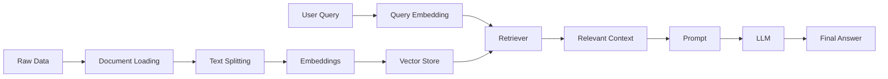
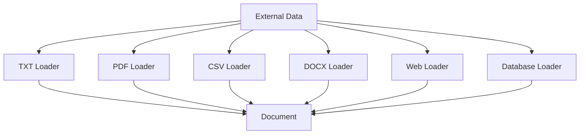
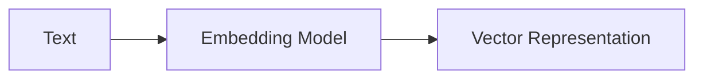

# 🧠 RAG — Retrieval-Augmented Generation

<p align="center">

# 🚀 RAG Learning

### From Documents → Knowledge → Retrieval → Context → Generation


</p>

---
# 🧠 RAG Learning

### Retrieval-Augmented Generation

Documents → Knowledge → Retrieval → Context → Generation

---

## 📦 Installation

Follow the steps below to set up the project locally.

### 1. Clone the Repository

```bash
git clone https://github.com/SubhasishElixor-HQ/Learn-RAG.git
cd Learn-RAG
```

### 2. Create a Virtual Environment

#### Using Python

```bash
python -m venv .venv
```

#### Activate on Windows PowerShell

```powershell
.venv\Scripts\Activate.ps1
```

#### Activate on Windows CMD

```cmd
.venv\Scripts\activate
```

#### Activate on macOS / Linux

```bash
source .venv/bin/activate
```

### 3. Install Dependencies

```bash
pip install -r requirements.txt
```

### ⚡ Using `uv`

If you use [`uv`](https://docs.astral.sh/uv/), you can create the environment and install dependencies faster:

```bash
uv venv
uv pip install -r requirements.txt
```

### 4. Verify Installation

Check that Python is available:

```bash
python --version
```

Check installed packages:

```bash
pip list
```

Or with `uv`:

```bash
uv pip list
```

### 5. Environment Variables

If your RAG application requires API keys, create a `.env` file in the project root:

```env
MODEL_API_KEY=your_api_key_here
```

**Never commit API keys to GitHub.**

Add the following to `.gitignore`:

```gitignore
.env
.venv/
__pycache__/
*.pyc
```

### 6. Run the Project

Run the main application:

```bash
python main.py
```

For individual learning modules:

```bash
python <filename>.py
```

---

## 🚀 Quick Setup

For a quick setup using `uv`:

```bash
git clone https://github.com/SubhasishElixor-HQ/Learn-RAG.git
cd Learn-RAG

uv venv
uv pip install -r requirements.txt

python Filename.py
```

---
# 📚 What is RAG?

**RAG (Retrieval-Augmented Generation)** is an architecture that allows an LLM to retrieve relevant information from an external knowledge source and use that information as context when generating an answer.

Instead of asking an LLM to answer only from its learned parameters:

```text
User Question
      ↓
     LLM
      ↓
   Answer
```

RAG introduces an external knowledge layer:

```text
                 ┌──────────────────┐
                 │   Knowledge Base  │
                 │ Documents / Data  │
                 └────────┬─────────┘
                          │
                          ▼
                    Retrieve Data
                          │
                          ▼
User Question ─────► Relevant Context
                          │
                          ▼
                         LLM
                          │
                          ▼
                     Final Answer
```

RAG is especially useful when an application needs to answer questions using **private, domain-specific, frequently changing, or external information**.

---

# 🎯 Why RAG?

LLMs have limitations:

* ❌ They may not know private company data
* ❌ Their knowledge can become outdated
* ❌ They can hallucinate
* ❌ They cannot automatically access every document
* ❌ Large documents cannot simply be placed into every prompt

RAG addresses these problems by retrieving relevant information before generation.

```text
             Traditional LLM
                  │
                  ▼
            Model Knowledge
                  │
                  ▼
               Answer


                 RAG
                  │
        ┌─────────┴─────────┐
        ▼                   ▼
 Model Knowledge      External Knowledge
        │                   │
        └─────────┬─────────┘
                  ▼
                LLM
                  │
                  ▼
              Answer
```

---

# 🏗️ RAG Architecture

A complete RAG system has two major phases:

## 1. Indexing

Prepare knowledge so that it can be searched efficiently.

## 2. Retrieval + Generation

Retrieve relevant knowledge at query time and give it to the LLM.



---

# 🔄 The Core RAG Pipeline

The fundamental RAG pipeline is:

```text
LOAD
  ↓
SPLIT
  ↓
EMBED
  ↓
STORE
  ↓
RETRIEVE
  ↓
CONTEXT
  ↓
GENERATE
  ↓
ANSWER
```

Current LangChain documentation describes the indexing side around documents, text splitters, embeddings, vector stores, and retrievers, followed by retrieval and generation.

---

# 01 — 📄 Documents

A **Document** represents information that can be processed and retrieved.

Examples:

```text
TXT
PDF
DOCX
CSV
JSON
HTML
Web Pages
Database Records
Notion
Google Drive
Slack
GitHub
```

Conceptually:

```text
Source
  │
  ▼
Document
  │
  ├── page_content
  │
  └── metadata
```

A document normally contains:

```text
Document
├── Content
│   └── Actual text
│
└── Metadata
    ├── source
    ├── page
    ├── title
    └── other information
```

Metadata becomes important later for filtering, citations, security, and source tracking.

---

# 02 — 📥 Document Loaders

Document loaders convert external data into a common document representation.



The goal is:

```text
Different Data Sources
        ↓
Standard Document Representation
        ↓
RAG Pipeline
```

LangChain's current documentation describes document loaders as providing a standard interface for bringing different sources into its `Document` representation.

---

# 03 — ✂️ Text Splitting

Large documents are usually divided into smaller pieces called **chunks**.

Why?

Because retrieving an entire large document is inefficient.

```text
Large Document
──────────────────────────────────────
│                                    │
│        Thousands of characters     │
│                                    │
──────────────────────────────────────
                  ↓
              Splitter
                  ↓
 ┌────────┐ ┌────────┐ ┌────────┐
 │Chunk 1 │ │Chunk 2 │ │Chunk 3 │
 └────────┘ └────────┘ └────────┘
```

### Important parameters

```text
chunk_size
chunk_overlap
separators
```

Example:

```text
Original Text

        ↓

Chunk 1
[AAAAAAAAAAAAAAAA]

Chunk 2
        [AAAAAAAAAAAAAAAA]

Chunk 3
                [AAAAAAAAAAAAAAAA]
```

The overlap helps preserve context between neighboring chunks.

`RecursiveCharacterTextSplitter` is one commonly recommended splitter for generic text in the current LangChain documentation.

---

# 04 — 🧩 Chunking Strategies

Chunking is more important than it initially appears.

Different data requires different strategies.

### Basic Chunking

```text
Document
   ↓
Fixed-size chunks
```

### Recursive Chunking

```text
Paragraph
   ↓
Sentence
   ↓
Word
   ↓
Character
```

### Semantic Chunking

```text
Document
   ↓
Meaning-based boundaries
   ↓
Semantic chunks
```

### Structure-aware Chunking

```text
PDF / Markdown / HTML
        ↓
Headers
Sections
Tables
Paragraphs
        ↓
Meaningful chunks
```

Good chunking improves retrieval quality.

---

# 05 — 🧠 Embeddings

An **embedding** converts text into a numerical vector that represents its semantic meaning.

```text
"Machine learning is a field of AI"
                 ↓
           Embedding Model
                 ↓
       [0.21, -0.43, 0.87, ...]
```

Conceptually:



Similar meanings should produce vectors that are close in vector space.

```text
                 AI
                ●
              ●
           ●
        ML

                         Pizza
                           ●
                         ●
```

Embeddings are used for semantic search and vector retrieval.

---

# 06 — 📐 Vector Similarity

Once text becomes vectors, we need a way to determine which vectors are similar.

Common similarity methods include:

* Cosine Similarity
* Dot Product
* Euclidean Distance

Conceptually:

```text
Query Vector
     │
     ├──────────────► Chunk A   ⭐⭐⭐⭐⭐
     │
     ├──────────────► Chunk B   ⭐⭐⭐⭐
     │
     └──────────────► Chunk C   ⭐
```

The most relevant chunks are retrieved based on similarity.

---

# 07 — 🗄️ Vector Stores

A **vector store** stores embeddings and associated documents so that they can be searched efficiently.

```mermaid
flowchart TD

A[Document Chunks]
      ↓
B[Embedding Model]
      ↓
C[Vectors]
      ↓
D[Vector Store]
      ↓
E[Similarity Search]
```

Examples:

```text
FAISS
Chroma
Qdrant
Pinecone
Milvus
pgvector
Weaviate
```

Vector stores provide the searchable knowledge layer of many RAG systems.

---

# 08 — 🔎 Retrieval

Retrieval is the process of finding the most relevant information for a user query.

```text
User Query
     ↓
Query Embedding
     ↓
Vector Search
     ↓
Top-K Results
     ↓
Relevant Context
```

Example:

```text
Question:
"What is the company's refund policy?"

             ↓

Retriever

             ↓

Chunk 17 ⭐
"Customers can request a refund within 30 days..."

Chunk 42
"Refunds require proof of purchase..."

Chunk 51
"Premium customers receive..."
```
A retriever takes a query and returns relevant documents; it can be backed by vector stores but is a more general abstraction.


🧑‍💻 Author

<div align="center">

Subhasish Sahoo

B.Tech — Computer Science & Artificial Intelligence / Machine Learning

Building and learning around:

AI • Machine Learning • Deep Learning
Generative AI • RAG • Agentic AI

<br>

<a href="https://github.com/SubhasishElixor-HQ">  </a>

</div>

⭐ Support

If this repository helps you understand RAG concepts:

⭐ Star the repository

🍴 Fork it

🧠 Experiment with the examples

🚀 Build your own RAG application

<div align="center">

🧠 Learn the fundamentals. Build the system. Understand what happens underneath.

Documents → Retrieval → Context → LLM → Knowledge

</div>
