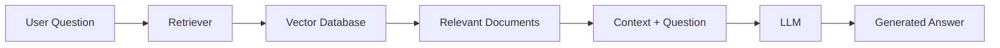
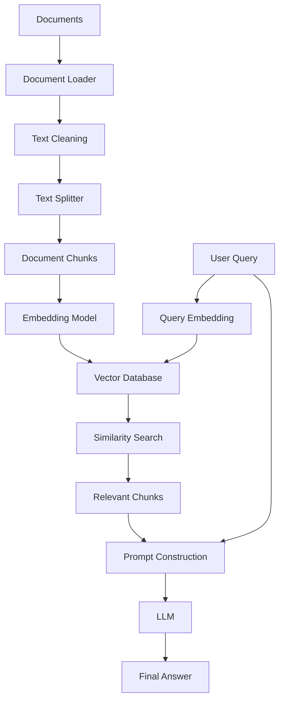

# 🧠 RAG Learning

<p align="center">
  
  
  
  
</p>

<p align="center">
  <b>My journey of learning Retrieval-Augmented Generation (RAG)</b>
</p>

---

## 📌 About This Repository

This repository contains my **RAG learning journey**, from basic concepts to advanced RAG systems.

I am learning how to build AI applications that can:

* 📄 Read documents
* ✂️ Split documents into useful chunks
* 🧠 Convert text into embeddings
* 🗄️ Store embeddings in vector databases
* 🔎 Retrieve relevant information
* 🤖 Give retrieved context to an LLM
* 💬 Generate grounded answers
* 🚀 Build real-world RAG applications

---

# 🤖 What is RAG?

**RAG = Retrieval-Augmented Generation**

RAG combines:

> **Information Retrieval + Large Language Models**

Instead of asking an LLM to answer only from its internal knowledge, RAG first retrieves relevant information from an external knowledge source and provides that information to the LLM.

### Simple idea

```text
User Question
      ↓
Retrieve Relevant Information
      ↓
Add Information to Prompt
      ↓
LLM
      ↓
Grounded Answer
```

---

# 🏗️ RAG Architecture



---

# 🔄 Complete RAG Pipeline



---

# 🧩 Core Concepts

## 1. 📄 Document Loading

The first step is loading knowledge from different sources.

Examples:

* PDF
* TXT
* CSV
* Web pages
* Word documents
* Databases
* APIs

Example:

```python
from langchain_community.document_loaders import PyPDFLoader

loader = PyPDFLoader("document.pdf")
documents = loader.load()
```

---

## 2. ✂️ Text Splitting

Large documents are divided into smaller chunks.

Why?

LLMs have context limits, and smaller chunks make retrieval more precise.

```text
Large Document
      ↓
Chunk 1
Chunk 2
Chunk 3
Chunk 4
...
```

Example:

```python
from langchain_text_splitters import RecursiveCharacterTextSplitter

splitter = RecursiveCharacterTextSplitter(
    chunk_size=500,
    chunk_overlap=50
)

chunks = splitter.split_documents(documents)
```

### Important parameters

| Parameter       | Meaning                    |
| --------------- | -------------------------- |
| `chunk_size`    | Maximum chunk size         |
| `chunk_overlap` | Shared text between chunks |

---

# 🧠 3. Embeddings

An embedding converts text into a numerical vector.

```text
"Machine Learning"
        ↓
[0.21, -0.43, 0.87, 0.15, ...]
```

Semantically similar text produces vectors that are close to each other.

### Example

```python
from langchain_huggingface import HuggingFaceEmbeddings

embeddings = HuggingFaceEmbeddings(
    model_name="sentence-transformers/all-MiniLM-L6-v2"
)
```

---

# 🗄️ 4. Vector Database

The generated embeddings are stored in a vector database.

Popular choices:

* FAISS
* Chroma
* Pinecone
* Weaviate
* Qdrant
* Milvus

### Basic flow

```text
Documents
    ↓
Chunks
    ↓
Embeddings
    ↓
Vector Database
```

---

# 🔎 5. Retrieval

When the user asks a question:

```text
User Query
    ↓
Query Embedding
    ↓
Similarity Search
    ↓
Top-K Relevant Chunks
```

The retriever finds the most relevant information from the knowledge base.

---

# 🤖 6. Generation

The retrieved information is provided to an LLM.

```text
Question
   +
Retrieved Context
   ↓
LLM
   ↓
Answer
```

This helps the model answer using information from the provided knowledge source.

---

# 🧠 7. Prompt Engineering

A RAG prompt commonly contains:

```text
System Instructions
        +
Retrieved Context
        +
User Question
        ↓
       LLM
        ↓
     Answer
```

Example:

```text
Answer the question using only the provided context.

Context:
{retrieved_context}

Question:
{question}
```

---

# 🔍 Retrieval Methods

### Basic Retrieval

```text
Query
 ↓
Vector Search
 ↓
Top-K Documents
```

### Hybrid Retrieval

Combines:

```text
Vector Search
      +
Keyword Search
      ↓
Better Retrieval
```

### Re-ranking

```text
Initial Retrieval
       ↓
Candidate Documents
       ↓
Re-ranker
       ↓
Most Relevant Documents
```

---

# 🚀 Advanced RAG Concepts

As I progress, I will explore:

* 🔹 Naive RAG
* 🔹 Advanced RAG
* 🔹 Hybrid Search
* 🔹 Metadata Filtering
* 🔹 Query Transformation
* 🔹 Query Expansion
* 🔹 Multi-Query Retrieval
* 🔹 Re-ranking
* 🔹 Context Compression
* 🔹 Parent-Child Retrieval
* 🔹 Multi-Vector Retrieval
* 🔹 Self-RAG
* 🔹 Corrective RAG
* 🔹 Agentic RAG
* 🔹 Graph RAG
* 🔹 Multimodal RAG
* 🔹 Evaluation
* 🔹 RAG Optimization

---

# 🧱 RAG Levels

```text
Level 1
Basic RAG
    ↓
Level 2
Better Chunking
    ↓
Level 3
Better Retrieval
    ↓
Level 4
Hybrid + Re-ranking
    ↓
Level 5
Advanced RAG
    ↓
Level 6
Agentic RAG
    ↓
Level 7
Production RAG
```

---

# 🛠️ Technology Stack

## Programming

* 🐍 Python

## AI / LLM

* LangChain
* Hugging Face
* LLM APIs
* Transformer models

## Embeddings

* Sentence Transformers
* Hugging Face Embedding Models

## Vector Databases

* FAISS
* Chroma
* Qdrant
* Pinecone

## Backend

* FastAPI

## Development

* VS Code
* Git
* GitHub
* uv
* Python virtual environments

---

# 📚 Learning Roadmap

```text
                    RAG
                     │
        ┌────────────┴────────────┐
        │                         │
   Fundamentals                LLMs
        │                         │
 Document Loading            Transformers
 Text Splitting              Prompting
        │                         │
        └──────────┬──────────────┘
                   │
              Embeddings
                   │
                   ↓
            Vector Database
                   │
                   ↓
              Retrieval
                   │
                   ↓
             RAG Pipeline
                   │
                   ↓
             Advanced RAG
                   │
                   ↓
              Agentic RAG
                   │
                   ↓
            Production RAG
```

---

# 📂 Repository Structure

```text
rag-learning/
│
├── 01-basics/
│   └── README.md
│
├── 02-document-loading/
│
├── 03-text-splitting/
│
├── 04-embeddings/
│
├── 05-vector-database/
│
├── 06-retrieval/
│
├── 07-langchain/
│
├── 08-huggingface/
│
├── 09-basic-rag/
│
├── 10-advanced-rag/
│
├── 11-agentic-rag/
│
├── projects/
│
├── main.py
├── requirements.txt
├── pyproject.toml
└── README.md
```

---

# 🧪 Example RAG System

```python
from langchain_huggingface import HuggingFaceEmbeddings
from langchain_community.vectorstores import FAISS

embeddings = HuggingFaceEmbeddings(
    model_name="sentence-transformers/all-MiniLM-L6-v2"
)

vectorstore = FAISS.from_documents(
    chunks,
    embeddings
)

retriever = vectorstore.as_retriever(
    search_kwargs={"k": 3}
)

results = retriever.invoke(
    "What is machine learning?"
)

for document in results:
    print(document.page_content)
```

---

# 🎯 What I Want to Build

My long-term goal is to understand RAG deeply enough to build:

```text
📄 Documents
      ↓
🧠 Knowledge Processing
      ↓
🔢 Embeddings
      ↓
🗄️ Vector Database
      ↓
🔎 Intelligent Retrieval
      ↓
🤖 LLM
      ↓
🧠 AI Agent
      ↓
⚡ Action
```

Eventually, I want to combine RAG with **Agentic AI** so the system can retrieve knowledge, reason about it, use tools, and complete tasks.

---

# 📊 RAG vs Traditional LLM

| Feature                 | Traditional LLM | RAG              |
| ----------------------- | --------------- | ---------------- |
| External Knowledge      | Limited         | ✅                |
| Private Documents       | ❌               | ✅                |
| Updated Knowledge       | Limited         | ✅                |
| Hallucination Reduction | Limited         | Better grounding |
| Document Q&A            | Limited         | ✅                |
| Company Knowledge       | Limited         | ✅                |
| Vector Search           | ❌               | ✅                |

---

# 🧠 Important RAG Problems

A good RAG system is not just:

```text
Documents → Embeddings → LLM
```

Important problems include:

* Poor chunking
* Bad embeddings
* Irrelevant retrieval
* Too much retrieved context
* Missing context
* Duplicate information
* Hallucinations
* Slow retrieval
* High inference cost
* Poor evaluation

Therefore:

> **Good RAG = Good Data + Good Retrieval + Good Context + Good Generation**

---

# 📈 RAG Evaluation

Important metrics:

### Retrieval

* Recall
* Precision
* Hit Rate
* MRR
* NDCG

### Generation

* Faithfulness
* Answer Relevance
* Context Relevance
* Correctness

### System

* Latency
* Cost
* Token usage
* Retrieval time

---

# 🧰 Useful Tools

| Category        | Tools                   |
| --------------- | ----------------------- |
| Language        | Python                  |
| Framework       | LangChain               |
| Models          | Hugging Face            |
| Embeddings      | Sentence Transformers   |
| Vector DB       | FAISS / Chroma / Qdrant |
| Backend         | FastAPI                 |
| Environment     | uv                      |
| IDE             | VS Code                 |
| Version Control | Git + GitHub            |

---

# 📖 Learning Progress

* [ ] RAG fundamentals
* [ ] Document loaders
* [ ] Text splitting
* [ ] Embeddings
* [ ] Vector databases
* [ ] Similarity search
* [ ] Retrievers
* [ ] LangChain
* [ ] Hugging Face
* [ ] Basic RAG
* [ ] Prompt engineering
* [ ] Hybrid search
* [ ] Re-ranking
* [ ] Advanced RAG
* [ ] RAG evaluation
* [ ] Agentic RAG
* [ ] Production RAG

---

# 🚀 Projects

Future projects:

### 1. 📚 Chat with PDF

Ask questions about PDF documents.

### 2. 🎓 Student Knowledge Assistant

RAG system for notes, syllabus, and study materials.

### 3. 💻 Codebase RAG

Ask questions about a software project's codebase.

### 4. 🏢 Business Knowledge Assistant

Search company documents and business knowledge.

### 5. 🤖 Agentic RAG

Combine RAG with AI agents and tools.

---

# 🌟 Final Goal

I don't want to learn RAG only as a framework.

I want to understand the complete system:

```text
Data
 ↓
Knowledge
 ↓
Embeddings
 ↓
Retrieval
 ↓
Context
 ↓
LLM
 ↓
Reasoning
 ↓
Agents
 ↓
Tools
 ↓
Actions
 ↓
Verified Outcome
```

This learning journey is part of my broader goal of building **AI systems that can understand knowledge and complete real-world workflows**.

---

## 👨‍💻 Author

**Subhasish Sahoo**

Computer Science & AI/ML Student

Learning:

```text
Machine Learning
        ↓
Deep Learning
        ↓
NLP
        ↓
LLMs
        ↓
RAG
        ↓
Agentic AI
        ↓
AI Outcome Systems
```

---

## ⭐ If you find this repository useful

Give the repository a ⭐ and follow the learning journey.

<p align="center">
  <b>Learn → Build → Experiment → Improve → Ship 🚀</b>
</p>